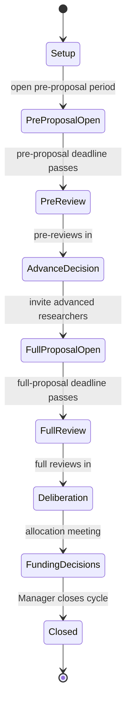

# Research Proposal Portal — Scope & Design Outline

**Client:** Washington State Wine Commission — Research Advisory Committee
**Purpose:** An end-to-end portal where researchers submit and manage proposals, the program manager runs the annual cycle, and committee members review and score. The Commission is not a system user; it receives a generated report.
**Status:** Design alignment draft. Reflects decisions made through scoping conversation.

---

## 1. Roles

Three roles authenticate; a fourth is a report recipient only.

- **Researcher** — self-registers, then must be approved by the Manager before doing anything further. Account and history persist across years. Manages own profile, submits proposals, submits reports.
- **Committee Member** — invited by the Manager (does not self-register). Reviews and scores assigned proposals. Reviews are siloed: a member never sees another member's scores or comments.
- **Program Manager** — runs everything. Approves researchers, builds the annual cycle, invites committee members, advances pre-proposals, drives the live allocation meeting, records funding decisions, sets report deadlines, generates the Commission report.
- **Commission** — not a user. Receives a system-generated report summarizing recommended projects and funding amounts at the end of a cycle.

---

## 2. Architecture & Stack

- **Frontend / hosting:** Next.js on Vercel.
- **Database:** Supabase Postgres. Chosen over a document store because the data is heavily relational (cycles → proposals → reviews → scores, plus multi-year chains).
- **Auth:** Supabase Auth. Researchers self-sign-up; committee members come in via Manager-issued email invites.
- **Access control:** Postgres Row Level Security enforces role boundaries — researchers see only their own records; reviewers see only assigned proposals and only their own reviews; the Manager sees everything.
- **File storage:** Supabase Storage for CVs, proposal documents, and report attachments.
- **Scheduled email:** pg_cron in Supabase triggers deadline reminders; transactional/event email via Resend.

At ~20 committee members and 20–30 researchers, this is a small, focused application. No real-time syncing is required (see the allocation tool below), which keeps the architecture simple.

---

## 3. Data Model

The data divides into a **persistent layer** that lives across all years and a **per-cycle layer** the Manager rebuilds annually.

### Persistent layer

- **Researcher** — account + profile: name, contact info, institution affiliation, current CV (file). Has an approval status (pending / approved). Owns all their proposals and reports across every cycle.
- **Project** — the through-line for a multi-year research effort. A project may span multiple cycles via annual resubmissions; it links the related proposals and reports so history is coherent. (A single-year project is just a project with one funded proposal.)
- **Committee Member** — account + basic profile, invited by Manager. Carries forward year to year unless removed.

### Per-cycle layer (Manager rebuilds each year)

- **Cycle** — one research year. Holds the calendar (pre-proposal open/close, full-proposal due, review deadlines, report deadlines), the total available funds for the year, and a state (see §4). The Manager marks it closed when funding is done.
- **Question Set** — the review questions for a stage. Two per cycle (pre-proposal and full), each a list of questions answered with a numeric score plus freeform comment. Editable year to year; copyable from the prior cycle as a starting point.
- **Document Slots** — the required/optional document definitions for each submission stage (see §7).

### Submission & review

- **Proposal** — a single submission by a researcher into a cycle. Typed as **pre-proposal**, **full**, or **off-cycle**. Carries a state (draft → in review → submitted, see §6), the uploaded documents, and — for full/off-cycle — a **per-year budget breakdown** (year 1/2/3 requested amounts) entered as structured data, not just a document.
- **Review** — one committee member's review of one proposal: their answers (score + comment per question), siloed from other reviewers. Roll-ups compute the proposal's **total score (sum)** and **average score**.
- **Funding Decision** — the Manager's recorded outcome for a proposal in the allocation meeting: funded amount (may be less than requested) or not funded.

### Reporting

- **Report** — a status or final report tied to a funded project/proposal: freeform narrative + file upload, against a Manager-set deadline.

---

## 4. The Annual Cycle (State Machine)

The Manager drives the cycle through these states:

- **Setup** — Manager creates the cycle, sets calendar and total budget, builds/copies the two question sets and document slots, invites/confirms committee members.
- **Pre-proposal open** — approved researchers upload pre-proposals; can save drafts and return until the deadline.
- **Pre-review** — committee scores pre-proposals against the pre question set.
- **Advance decision** — Manager (informed by committee) selects which pre-proposals are invited to submit full proposals.
- **Full proposal open** — invited researchers upload full proposals with per-year budgets; draft-and-return until deadline.
- **Full review** — committee scores full proposals against the full question set.
- **Deliberation** — the allocation meeting; Manager drives the live tool.
- **Funding decisions** — funded amounts recorded.
- **Closed** — Manager closes the cycle; unspent funds are a Manager/committee decision picked up when the next cycle's budget is set.

---

## 5. Modules

### 5.1 Registration & Profile (two-stage)
Researcher self-registers with name, institution, and CV — this is a *request*, not an active account. Manager reviews a pending-approvals queue and approves. Only then can the researcher complete their profile and submit anything. Approved researchers manage their own profile, view all past proposals, and access reports due on funded projects.

### 5.2 Cycle Setup
Manager creates a cycle and configures: calendar dates, total available funds, the pre and full question sets (copyable from last year, then edited), and the document slots per stage. Committee member invitations are managed here.

### 5.3 Pre-proposal Submission & Review
Researchers upload pre-proposal documents. Committee scores them against the pre question set. Manager uses scores/comments to decide which advance.

### 5.4 Full Proposal Submission & Review
Invited researchers upload full proposal documents and enter the per-year budget breakdown. Committee scores against the full question set.

### 5.5 Draft Workflow
Every proposal is a living record: **draft → in review → submitted**. Researchers save and return across sessions while in draft, run their own pre-submission review step, then submit. Submission soft-locks the record; **the Manager can reopen it** if the researcher needs to fix something before the deadline.

### 5.6 Allocation / Deliberation Tool (Manager-only)
A single Manager screen, shared on a meeting display — no multi-user real-time syncing required. It lists each advanced project with: requested amount (current year), a funding-decision input (can be less than requested), the project's total and average score, and a comments button opening that project's reviewer comments. A running tally shows **total available, allocated so far, and remaining**. Funding an amount updates the remaining figure live for the room.

### 5.7 Funding Decisions & Commission Report
Recorded decisions feed a generated Commission report: the recommended projects and funding amounts for the cycle, plus the totals. Output is the committee's formal recommendation to the Commission.

### 5.8 Multi-year Continuation
Continued funding is annual. A multi-year project requires a **fresh resubmission** each year and is funded from **that year's** pool, counted in the year spent. The project record links the annual proposals and reports into one history.

### 5.9 Forward Projection / Planning Tool (Manager)
A planning view where the Manager enters estimated available funds for future years and the expected annual ask of each ongoing multi-year project. The tool nets these to show worst-case headroom for new projects (i.e., what's left if every ongoing project is renewed). This is planning input, separate from the live allocation tool.

### 5.10 Off-cycle Proposals
The Manager invites a specific approved researcher to submit off-cycle. It skips the pre-proposal stage, goes straight to a full submission, and on submission the committee scores it using the full question set. **Off-cycle funding comes from a different source and sits outside the annual pool** — it is not drawn against the cycle's allocation tally. The Manager accounts for any effect when setting the next cycle's budget.

### 5.11 Reports (status & final)
Funded projects require status reports during the year and a final report at completion. Each is a freeform narrative plus a file upload, against Manager-set deadlines. Researchers submit them inside the app; the Manager sees submission status and overdue reports.

### 5.12 Historical / Analytics Reporting
Persistent reporting across cycles: per cycle, the number of proposals submitted, funds available, funds allocated, average score, and the list of funded projects with amounts. A historical view shows projects and amounts funded over time and each cycle's budget. Simple, read-only summaries for the Manager and for institutional memory.

### 5.13 Notifications
Event- and deadline-driven email (see §8).

---

## 6. Document Slots

Rather than a single file upload, each submission stage has a Manager-defined set of document slots, configurable per cycle. Each slot has a name, a required/optional flag, and an accepted file type. This handles "different documents required" cleanly and stays consistent with how questions and the calendar are configured year to year. Example full-proposal slots: proposal narrative (required), budget document (required), current CV (required), supporting materials (optional). The per-year budget remains a *structured data* entry feeding the allocation and projection tools, even if a budget document is also uploaded.

---

## 7. Review & Scoring

Each committee member answers each question in the stage's set with a numeric score and a freeform comment. Reviews are submitted in a silo — no member sees another's scores or comments. Per proposal, the system displays both the **total score (sum across reviewers)** and the **average score**. Both appear in the allocation tool; comments are viewable behind the comments button.

---

## 8. Notification Triggers

| Recipient | Trigger | Message |
|---|---|---|
| Researcher | Pre-proposal period opening / approaching deadline | Submit pre-proposal by date |
| Researcher | Pre-proposal approved to advance | Invited to submit full proposal; full deadline |
| Researcher | Full-proposal deadline approaching | Reminder |
| Researcher | Project funded | Notice + upcoming report deadlines |
| Researcher | Status/final report deadline approaching | Reminder |
| Researcher | Off-cycle submission invited | Invitation + deadline |
| Committee Member | Proposals assigned for review | Review needed + review deadline |
| Committee Member | Review deadline approaching | Reminder |
| Manager | New researcher registration pending | Approval needed |
| Manager | Reviews complete for a stage | Ready to advance / deliberate |

Deadline reminders run on pg_cron; event notices (approval, funding, assignment) fire on the triggering action.

---

## 9. Suggested Phasing

To get a usable system in front of the committee for one full cycle, then extend:

- **Phase 1 (core cycle):** registration + Manager approval, profiles, cycle setup, pre- and full-proposal submission with drafts + soft lock, document slots, siloed review/scoring, allocation tool, funding decisions, Commission report, core notifications.
- **Phase 2 (lifecycle):** multi-year continuation linking, status/final reports, report deadlines and reminders, off-cycle flow.
- **Phase 3 (planning & insight):** forward projection tool, historical/analytics reporting.

Phasing is a suggestion, not a constraint — if any Phase 2/3 item is needed for the first live cycle, it moves up.

---

## 10. Open / To Confirm

- **Multiple proposals per researcher per cycle** — assumed allowed. Confirm.
- **Committee assignment** — assumed all members review all proposals in a stage (vs. subsets). Confirm; if subsets, assignment becomes a Manager step.
- **CV currency** — profile CV vs. a per-proposal CV slot. Currently both exist (profile CV + optional document slot). Confirm whether the profile CV should auto-attach to submissions.
- **Email volume / domain** — Resend needs a verified sending domain for the Commission. Minor setup item.
